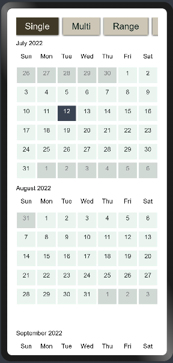
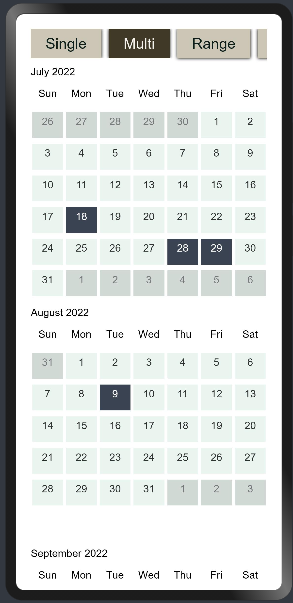
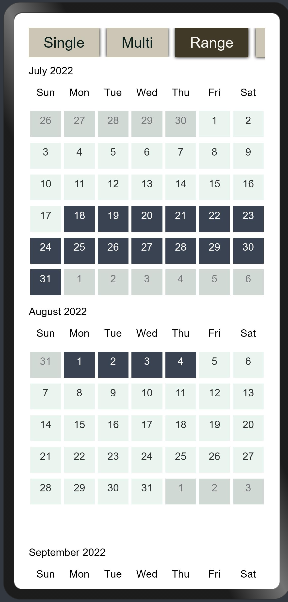
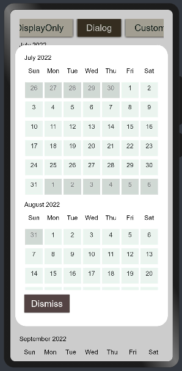
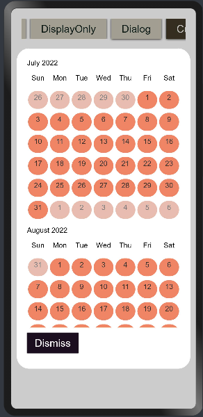
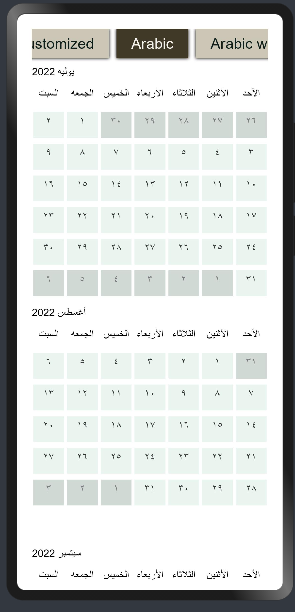
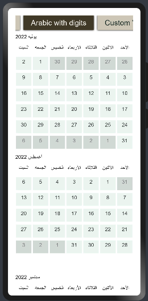
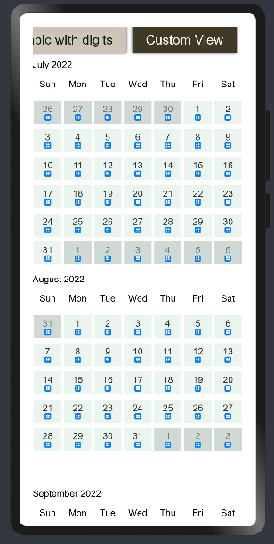

# Times Square
****
Times Square helps you to pick and customize calendar with multiple attributes and support for Arabic calendar 
## Download & Install
****
Install using: 
```
npm i @ohos/times_square
```
For using Times Square in your app, add the below dependency in the entry/package.json  
```
"dependencies": {
    "@ohos/times_square": "file:../times_square"
  }
```

## Usage instructions
****
#### Import all components at once
```
import { CalendarMainModel, CalendarType } from '@ohos/times_square'
```

#### Code
To use the calendar dependency
```
CalendarMainModel({
  options{
          tsTypeOfCalendar: CalendarType.SINGLE, // Type of Calendar CalendarType.[Single|Multi|Range]
          tsBgColor: "#FFFFFF", //Calendar background color
          tsGridTextSize: '14fp', //Calendar grid text size
          tsMonthTextSize: '14fp', //Calendar month text size
          tsMonthTextColor: "#000000", //Calendar month text color
          tsSelectedTextColor: "#fafafa", //Calendar selected text color
          tsSelectedGridBackgroundColor: "#3a4352", //Calendar selected grid background color
          tsNotInMonthTextColor: "#787a7d", //Calendar not in month text color
          tsInMonthColor: "#ebf5ef", //Calendar in month text color
          tsNotInMonthColor: "#d0d9d4", //Calendar grid not in month color
          tsInMonthTextColor: "#303133", //Calendar grid in month color
          tsSetSelection: true, //Setting selection
          tsWithNumbers: true, //Display numbers [For arabic only]
          tsLanguage: "English", //[English|Arabic]
          tsGridShape: "Square", //Calendar grid shape [Square|Circle]
          tsDayIcon: $r('app.media.app_icon'), //Calendar day icon
          }
```
Options : CalendarOptions to set the options of the calendar
For example : 
```
options: {
            tsTypeOfCalendar: CalendarType.SINGLE,
            tsBgColor: "#FFFFFF",
            tsGridTextSize: '14fp',
            tsMonthTextSize: '14fp',
            tsMonthTextColor: "#000000",
            tsSelectedTextColor: "#fafafa",
            tsSelectedGridBackgroundColor: "#3a4352",
            tsNotInMonthTextColor: "#787a7d",
            tsInMonthColor: "#ebf5ef",
            tsNotInMonthColor: "#d0d9d4",
            tsInMonthTextColor: "#303133",
            tsSetSelection: true,
            tsWithNumbers: true,
            tsLanguage: "English",
            tsGridShape: "Square",
            tsDayIcon: $r('app.media.app_icon')
          }
```
## Screenshots
****








## Attributes
****
You can style the Calendar  using theses attributes :

| Attribute | Description |
| -------- | ----------- |
|tsTypeOfCalendar|Type of the calendar|
|tsBgColor|Background color of the calendar|
|tsGridTextSize|Calendar grid text size|
|tsMonthTextSize|Calendar month text size|
|tsMonthTextColor|calendar month text color|
|tsSelectedTextColor|Calendar selected date text color|
|tsSelectedGridBackgroundColor|Calendar selected date background color|
|tsNotInMonthTextColor|Calendar not in month text color|
|tsInMonthColor|Calendar in month text color|
|tsNotInMonthColor|Calendar not in month background color|
|tsInMonthTextColor|Calendar in month background color|
|tsSetSelection|Calendar setting for selection|
|tsWithNumbers|Calendar to show numbers (For arabic)|
|tsLanguage|Calendar set language|
|tsGridShape|Calendar grid shape|
|tsDayIcon|Calendar grid icon|

## Compatibility
****
Supports OpenHarmony API version 9
## Code Contribution
****
If you find any problems during usage, you can submit an [issue](https://github.com/satvikshubham/times-square/issues) to us. Of course, we also welcome you to send us PR.
## Open source License
****
This project is based on [Apache License 2.0](./LICENSE), please enjoy and participate in open source freely.
